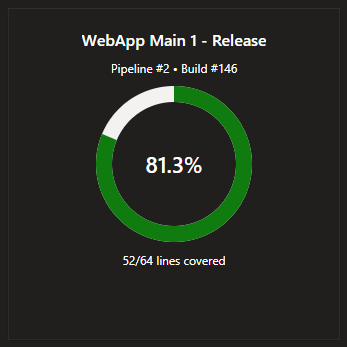

# Code Coverage Pizza - Azure DevOps Dashboard Widget

This extension provides a dashboard widget that shows a pizza (pie) graph of code coverage from the latest completed build for a list of selected pipeline IDs.

Features:
- Select one or more pipelines via the configuration dialog (with a searchable list of available pipelines in the current project).
- The widget fetches the latest completed build per pipeline and aggregates line coverage from the Test Code Coverage REST API.
- Displays coverage as a colored pie with percentage and covered/total lines.
- Gracefully handles no builds/no coverage cases.

## Configuration
- Open the widget configuration to choose pipelines. Use the search filter to quickly locate pipelines by name or id.
- The selection is saved as custom settings and used by the widget to render pies. You can add/remove pipelines any time.

## Notes
- Ensure your builds publish code coverage. The widget shows "No coverage data" if the latest build lacks coverage results.
- Colors: green (>= 80%), yellow (>= 50%), red (< 50%).
- Works with both YAML Pipelines (via the Pipelines API) and classic Build Definitions (fallback API).

## Screenshots
